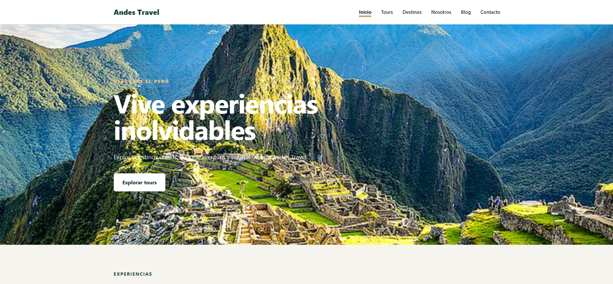
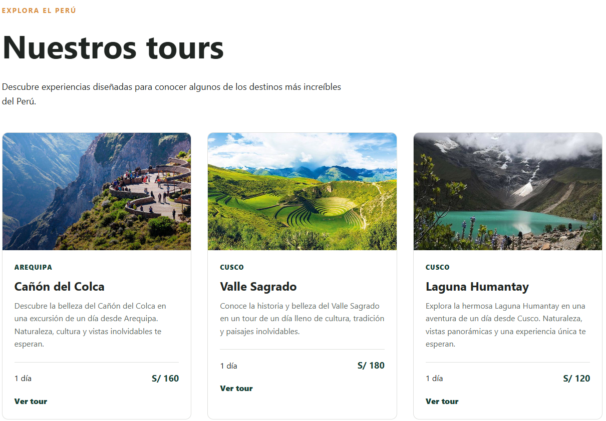
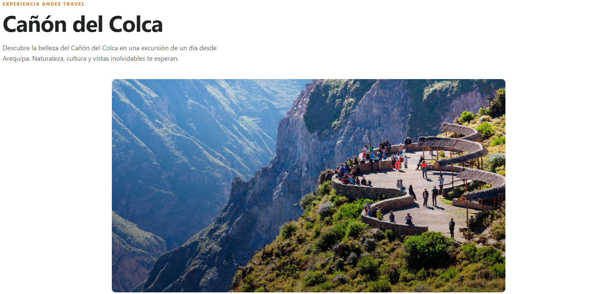
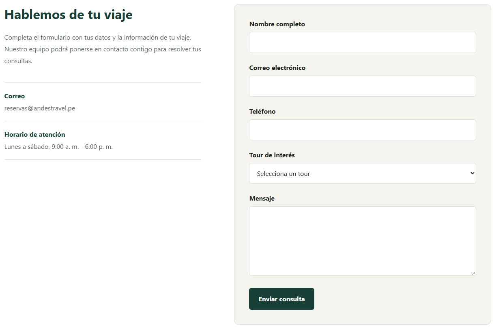
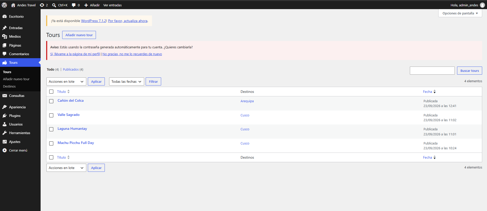

# Andes Travel

Andes Travel es un sitio web turístico desarrollado con WordPress mediante un tema y un plugin personalizados. El proyecto permite gestionar tours, destinos, contenido de blog y solicitudes de información desde el panel administrativo de WordPress.

El proyecto fue desarrollado como parte de mi formación práctica en desarrollo web con WordPress, aplicando PHP, MySQL, WordPress APIs, desarrollo de temas y plugins, responsive design, seguridad básica y optimización web.

## Características principales

- Tema de WordPress desarrollado desde cero.
- Plugin personalizado para la lógica principal del sitio.
- Gestión dinámica de tours mediante Custom Post Types.
- Clasificación de tours mediante taxonomías de destinos.
- Campos personalizados para precio, duración, dificultad y tours destacados.
- Consultas dinámicas mediante `WP_Query`.
- Página de inicio con tours destacados.
- Archivo y páginas individuales de tours.
- Filtrado de tours por destino.
- Blog dinámico utilizando las entradas nativas de WordPress.
- Formulario de contacto personalizado.
- Preselección automática del tour solicitado.
- Almacenamiento de consultas en el panel de administración.
- Validación y sanitización de formularios.
- Protección mediante nonces y comprobación de permisos.
- Diseño responsive para desktop, tablet y móvil.
- Imágenes responsive mediante `srcset` y `sizes`.
- Optimización básica de SEO, accesibilidad y rendimiento.
- Página 404 personalizada.

## Capturas

### Página de inicio

### Catálogo de tours

### Detalle de un tour

### Formulario de contacto

### Administración de tours

## Tecnologías utilizadas

- WordPress
- PHP
- MySQL
- HTML5
- CSS3
- JavaScript
- Git
- GitHub
- Local

## Arquitectura

El proyecto separa la presentación de la lógica funcional.

### Tema

Ubicación:

`app/public/wp-content/themes/andes-travel/`

El tema se encarga principalmente de:

- Templates.
- Presentación visual.
- Navegación.
- Responsive design.
- Carga de CSS y JavaScript.
- Renderizado de tours, destinos y artículos.

### Plugin

Ubicación:

`app/public/wp-content/plugins/andes-travel-core/`

El plugin `Andes Travel Core` contiene la funcionalidad principal:

- Custom Post Type `tour`.
- Custom Post Type para consultas.
- Taxonomía `destination`.
- Custom fields de tours.
- Meta boxes del administrador.
- Procesamiento del formulario de contacto.
- Validación, sanitización y persistencia de consultas.

## Seguridad

El proyecto aplica diferentes mecanismos proporcionados por WordPress:

- Nonces para verificar formularios.
- Comprobación de permisos mediante capabilities.
- Sanitización de datos de entrada.
- Validación de datos.
- Escape de datos al generar HTML.
- Validación de identificadores de tours.
- Patrón Post/Redirect/Get para evitar reenvíos accidentales.

## Rendimiento y accesibilidad

Durante el desarrollo se utilizó Lighthouse para detectar y corregir problemas relacionados con rendimiento, SEO y accesibilidad.

Entre las optimizaciones realizadas se encuentran:

- Priorización de la imagen LCP del Hero.
- Imágenes responsive.
- Lazy loading en imágenes secundarias.
- Versionado automático de assets.
- Mejora del contraste de elementos visuales.
- Meta descriptions dinámicas.
- Sitemap XML de WordPress.

En las pruebas locales realizadas como visitante se alcanzaron resultados de referencia de:

- Performance: 97
- Accessibility: 100
- SEO: 100

La puntuación de Best Practices en el entorno local estuvo condicionada por el uso de HTTP. Las configuraciones de HTTPS y cabeceras de seguridad corresponden al entorno de producción.

## Instalación local

Este repositorio contiene principalmente el código personalizado desarrollado para Andes Travel. WordPress Core, la base de datos, los archivos de configuración local y los uploads no se versionan en el repositorio.

Para utilizar el tema y el plugin en una instalación de WordPress:

1. Instala WordPress en un entorno local o servidor compatible.
2. Copia el tema ubicado en:

   `app/public/wp-content/themes/andes-travel/`

   dentro de:

   `wp-content/themes/`

3. Copia el plugin ubicado en:

   `app/public/wp-content/plugins/andes-travel-core/`

   dentro de:

   `wp-content/plugins/`

4. Activa el tema **Andes Travel** desde el panel de WordPress.
5. Activa el plugin **Andes Travel Core**.
6. Configura los enlaces permanentes de WordPress.
7. Crea las páginas necesarias y configura el menú principal.
8. Agrega tours, destinos y contenido desde el panel administrativo.

La información de contenido utilizada durante el desarrollo local no forma parte del repositorio porque se almacena en la base de datos de WordPress.

## Estado del proyecto

El proyecto cuenta con las funcionalidades principales implementadas y ha pasado pruebas manuales de navegación, responsive design, formularios, consultas, páginas 404 y depuración de PHP.

## Mejoras futuras

- Protección anti-spam mediante rate limiting, honeypot o CAPTCHA.
- Sistema avanzado de búsqueda y filtros de tours.
- Integración de reservas.
- Envío de correos de confirmación.
- Gestión avanzada de SEO.
- Optimización de imágenes en formatos WebP/AVIF.
- Internacionalización del contenido.

## Autor

Eusebio Luciano

Estudiante de Ingeniería de Sistemas e Informática.